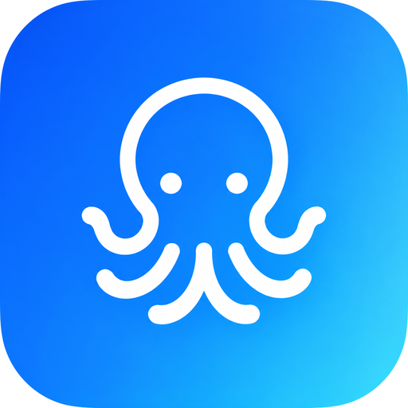
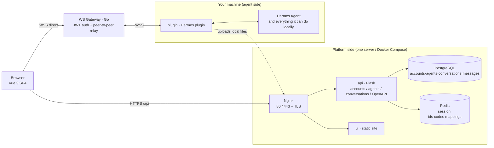

<p align="center">
  
</p>

# Harness Mate

**An end-to-end agent platform — turn the AI agent running on your own machine into a web product anyone can use.**

> 中文版：[README.md](README.md)

Your local AI agent is powerful, but only you can reach it: the terminal, the scripts, the local files — nobody else gets in. Harness Mate closes that last mile: colleagues and customers open a browser, chat with your agent and exchange files with it — **without moving the agent to the cloud, and without writing any integration code**.

It ships with a [Hermes Agent](https://hermes-agent.nousresearch.com/) adapter by default; the channel protocol is open, so supporting another agent means implementing a single adapter.

- 🌐 **Live demo**: <https://harness.alltman.com>
- 📘 **中文文档**: [README.md](README.md)

---

## Quickstart

Connect the Hermes Agent on your machine to the platform — **five steps, really just one command plus two values.**

**1) Get the credentials**

Open <https://harness.alltman.com> → sign in → "个人空间" (Personal Space) → the agent card's "⋯" menu → "配对 Hermes" (Pair Hermes). The dialog shows this agent's `bot_id` and `bot_key`; you can also click "一键复制安装指令" (Copy install command) to grab a script with the credentials already filled in.

**2) Install the plugin** (it lives in the `plugin/` subdirectory of this repo)

```bash
hermes plugins install liaosiliangCodeLife/harness-mate-plat/plugin --yes-deps --enable
```

**3) Write the credentials** (replace `<bot_id>` / `<bot_key>` with step 1's values)

```bash
cat >> ~/.hermes/.env <<'EOF'
HARNESS_MATE_BOT_ID=<bot_id>
HARNESS_MATE_BOT_KEY=<bot_key>
EOF
```

**4) Check the gateway address**

Open `~/.hermes/plugins/HarnessMate/adapter.py`, line 62 (`WS_GATEWAY_WS_URL`), and make sure it points at your gateway (`wss://<host>:<port>/ws`). Nothing to change if you use the gateway deployed from this repo.

**5) Restart and verify**

```bash
hermes gateway restart
```

When the log shows `harness_mate 已连接 WS 网关: bot_id=…` you are connected; open the platform, enter the agent and send a message — a reply means the whole path works.

> Full steps, dependency install, configuration and troubleshooting: [plugin/INSTALL.md](plugin/INSTALL.md).

---

## Contents

- [Quickstart](#quickstart)
- [The problem it solves](#the-problem-it-solves)
- [Core capabilities](#core-capabilities)
- [Architecture](#architecture)
- [Local development](#local-development)
- [Production deployment](#production-deployment)
- [Configuration](#configuration)
- [Repository layout](#repository-layout)
- [Protocol docs](#protocol-docs)
- [Tech stack](#tech-stack)
- [Security & boundaries](#security--boundaries)
- [Community & support](#community--support)

---

## The problem it solves

| A local agent today | After Harness Mate |
|---|---|
| Usable only on this machine; switch devices and it's gone | Works in any browser, phones included |
| No accounts — everyone using it *is* you | Email login, email-code signup, GitHub OAuth, single-session login |
| Conversations scattered in local files | Conversations/messages persisted, paged history, consistent across devices |
| Images and documents copied by hand | Two-way files: users upload to the agent, the agent sends files back |
| Integrating with your own systems means building a bridge | Open API (OpenAPI) you can call directly |
| No idea whether the agent is online | Online status consistent across the whole platform |

## Core capabilities

- **Agent management** — create, edit and delete agents; each agent gets a gateway identity (`bot_id` + key) and can point at a different machine or a different agent.
- **Realtime conversations** — the browser connects **straight to the gateway** over WebSocket and exchanges messages peer-to-peer with the agent; streaming output (including a "thinking" state) and message persistence included.
- **Stop generation** — abort a running turn with one click (a stop frame is sent to the agent), so nothing gets stuck in "generating".
- **Files and images, both ways** — users upload images/documents to the agent; when the agent sends back a local file it uploads it to the platform first, and the chat renders a thumbnail (click to zoom) or a file card.
- **Online status** — list page, detail page and conversation cards share one definition, so you never see "online outside, offline inside".
- **Accounts** — password login, email verification-code signup, GitHub OAuth, and **single-session login** (one account may be online in exactly one browser at a time; a new login kicks the old one out, tracked via Redis).
- **Open API** — API key management, server/agent info, and an authorization-free file upload endpoint for wiring into your own systems.
- **One-command deployment** — Docker Compose brings up ui / api / postgres / redis / nginx / certbot, and Nginx issues and renews Let's Encrypt certificates automatically.

## Architecture



Two paths, two jobs:

- **HTTP path (browser → Nginx → api)**: accounts, agents, conversations, message CRUD, file upload, open API.
- **WebSocket path (browser ⇄ gateway ⇄ plugin ⇄ agent)**: realtime messages and streaming replies. The gateway only authenticates and relays peer-to-peer (delivering by exact `ws_session_id`) — it never parses business payloads; the agent-side plugin talks to the local agent.

## Local development

### 1. Prerequisites

- A machine to run the platform on (Linux recommended, macOS works)
- PostgreSQL and Redis (the Compose stack below brings both up in production)
- [Hermes Agent](https://hermes-agent.nousresearch.com/) installed locally

```bash
curl -fsSL https://hermes-agent.nousresearch.com/install.sh | bash
```

### 2. Start each service

**Backend (api)**

```bash
cd api
python3 -m venv .venv && source .venv/bin/activate
pip install -r requirements.txt -i https://mirrors.cloud.tencent.com/pypi/simple/
cp .env.example .env          # fill in database, Redis, upload and mail settings
FLASK_APP=app.http.app flask run --port 5001 --host 127.0.0.1
```

**Frontend (ui)**

```bash
cd ui
npm install                   # or yarn
cp .env.example .env.development.local   # VITE_API_PREFIX points at the local backend
npm run dev                   # http://localhost:5173
```

**WS gateway (gateway)**

```bash
cd gateway
go build -o gateway .
WS_GATEWAY_PORT=8765 ./gateway   # listens on 8765 by default; keep the JWT secret in sync with the agent config
```

**Agent-side plugin (plugin)**: install it into Hermes with one command — `hermes plugins install liaosiliangCodeLife/harness-mate-plat/plugin --yes-deps --enable` — then fill in the gateway address, `bot_id` and `bot_key`. Full steps: [plugin/INSTALL.md](plugin/INSTALL.md). The plugin also uploads the agent's local files to the platform and sends them back with the reply.

### 3. Send your first message

1. Open the frontend in a browser → sign up → sign in
2. "Personal Space" → create an agent → fill in the gateway address and key
3. Enter the agent → create a conversation → send a message and see if the agent replies
4. (Optional) ask it for a local image to verify the file path

## Production deployment

`docker/` holds a single-host Compose stack (ui / api / postgres / redis / nginx / certbot) configured entirely by the `.env` in the same directory:

```bash
cd docker
cp .env.example .env      # domain, database password, upload and mail settings
docker compose build ui api
docker compose up -d
```

The first run needs a certificate (the top of `docker-compose.yaml` documents the full recipe): temporarily comment out Nginx's 443 block, start the containers, issue the certificate with certbot's webroot mode, then restore and reload. After that the certbot container renews it every 12 hours.

> In production: use strong passwords, keep `.env` out of version control (ignored by default), and rate-limit the authorization-free upload endpoint as needed.

## Configuration

| Location | Purpose |
|---|---|
| `api/.env` | Backend: database URL, Redis, JWT secret, object storage, SMTP |
| `docker/.env` | Deployment: Compose service parameters, domain and certificate email |
| `ui/.env.development.local` | Local development: `VITE_API_PREFIX` pointing at the local backend |
| `ui/.env.production` | Production build: `/api` when served behind the Nginx reverse proxy |

Only `.env.example` is committed; real `.env` files never enter the repository.

## Repository layout

```
api/       Backend (Flask): accounts, agents, conversations, messages, open API
ui/        Frontend (Vue 3 + Vite): home, agent space, conversation cards, open API
gateway/   WS gateway (Go): JWT auth, session mapping, peer-to-peer relay
plugin/    Agent-side plugin (Python): talks to the local agent, sends files/images back
docker/    Docker Compose deployment: nginx, certbot, postgres, redis
```

## Protocol docs

- [gateway/ws_gateway_protocol.md](gateway/ws_gateway_protocol.md) — the gateway's WebSocket protocol: connect, authenticate, session ids, message envelope
- [plugin/hermes_channel_protocol.md](plugin/hermes_channel_protocol.md) — the platform ⇄ agent channel protocol: inbound messages, reply frames, streaming and file fields

Both protocols are independently implementable: swap the agent or swap the frontend, and as long as they follow the docs they interoperate.

## Tech stack

| Module | Main technologies |
|---|---|
| Frontend | Vue 3, TypeScript, Vite, Pinia, Arco Design Vue, TailwindCSS |
| Backend | Python, Flask, SQLAlchemy, Flask-Login, Marshmallow, Alembic, Gunicorn |
| Storage | PostgreSQL, Redis, object storage (Tencent COS) |
| Gateway | Go, gorilla/websocket, JWT (golang-jwt), go-redis, viper |
| Plugin | Python, WebSocket client |
| Deployment | Docker Compose, Nginx, Certbot (Let's Encrypt) |

## Security & boundaries

- Real config (`.env`), certificate private keys and the upload directory never enter version control.
- Logins use JWT; **single-session login** means Redis holds the currently valid session id per account, and a new login invalidates the old token immediately.
- Gateway connections require JWT auth, signed with the key configured on the platform side for that agent.
- `POST /open-api/upload-file` is an **authorization-free** upload endpoint (used by the agent side to send files back); size and type limits apply by default — add gateway rate limiting or origin checks for public deployments.
- The agent-side plugin identifies itself with `bot_id` / `bot_key`, and `dm_policy` controls who may message it.

## License

Released under the [MIT](LICENSE) license. Copyright (c) 2026 liaosiliangCodeLife.

## Acknowledgements

- [Hermes Agent](https://hermes-agent.nousresearch.com/) — the local agent runtime it connects to by default
- Every upstream open-source project that makes this chain work

## Community & support


Scan with WeChat or WeCom to join the community group — questions, feedback and usage chat are all welcome.

Report issues: **liaosiliang1234@126.com** (an AI fixes them automatically every day).

### Bug report format

Please use these three lines when reporting — it is the fastest way to reproduce and fix:

```
1. What happens:
2. Steps to reproduce:
3. Always reproducible?:
```
