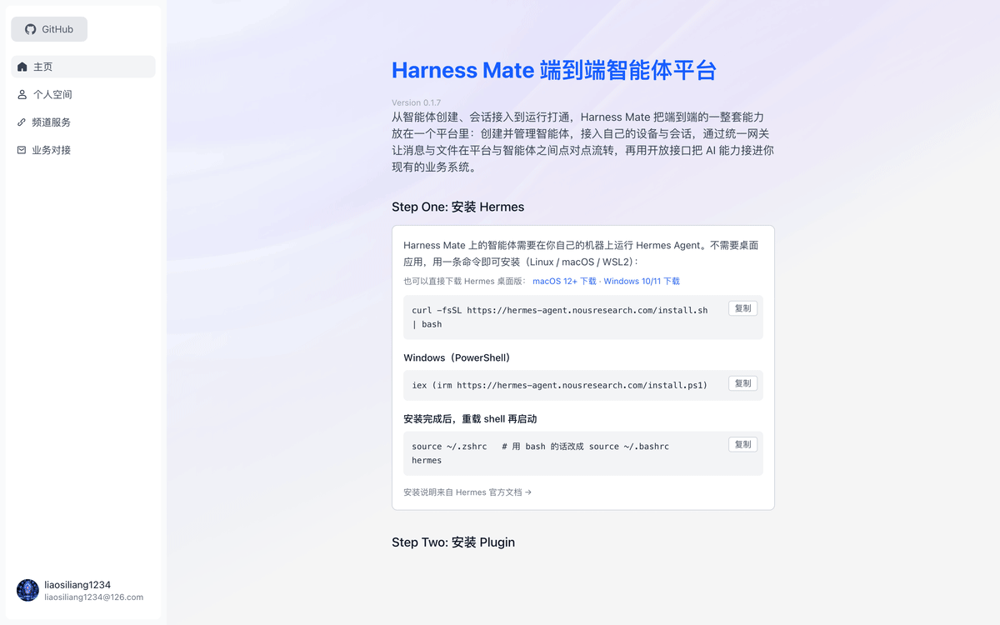
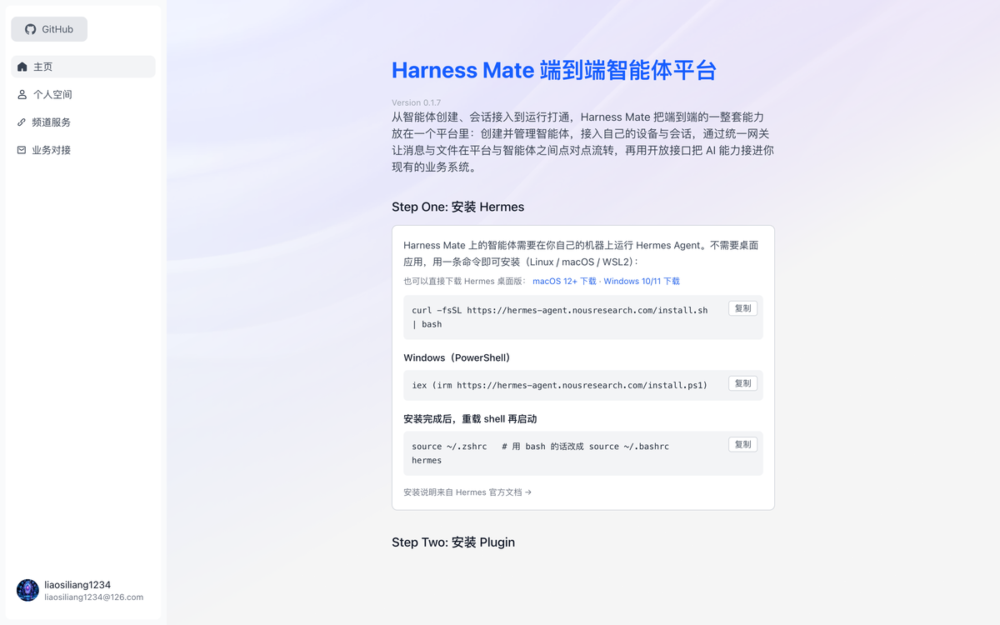
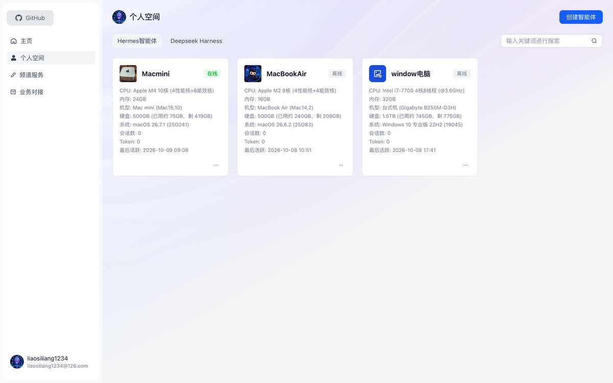
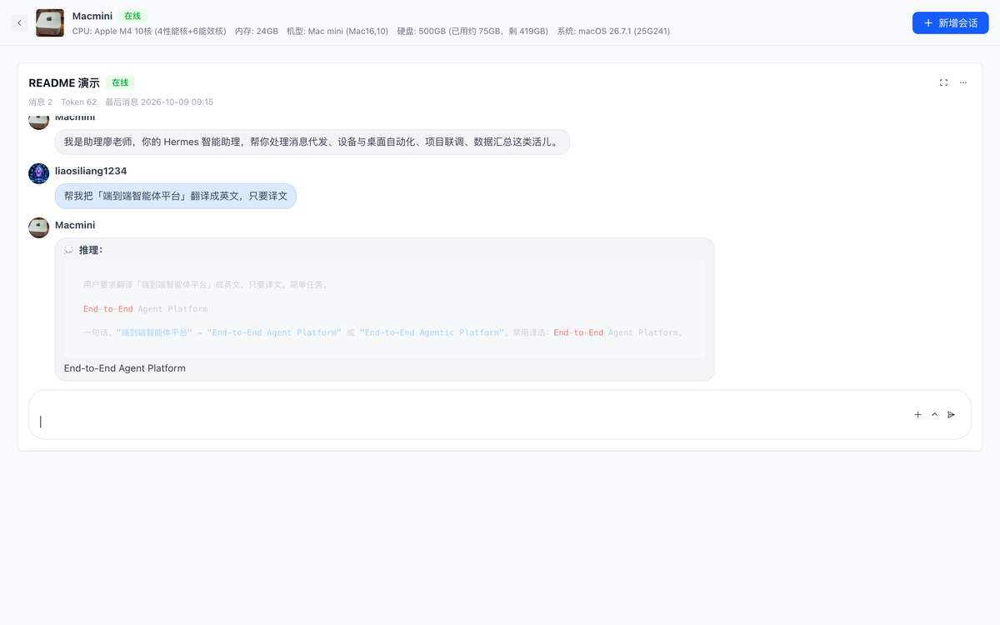
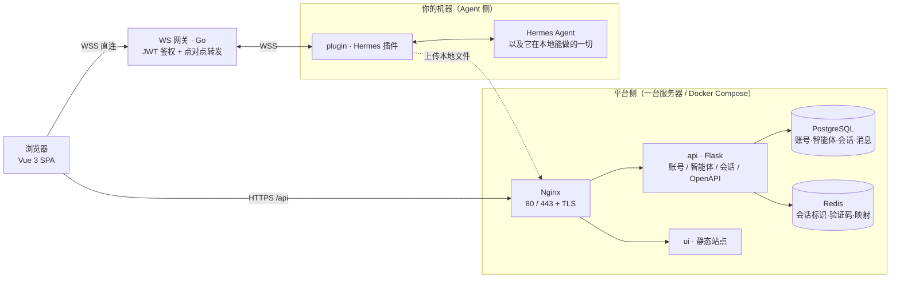

<p align="center">
  
</p>

# Harness Mate

**端到端智能体平台 —— 把你自己电脑上的 AI Agent 变成一个人人可用的 Web 产品。**

> End-to-end agent platform: turn the AI agent running on your own machine into a multi-user web product — chat, files, and open APIs included.

跑在你本机的 AI Agent 很强，但只有你能用：终端、脚本、本机文件，别人碰不到。Harness Mate 补的是这最后一公里 —— 同事和客户打开浏览器就能跟它对话、互传文件，而**你不需要把 Agent 搬到云上，也不用写接入代码**。

目前默认对接 [Hermes Agent](https://hermes-agent.nousresearch.com/)，通道协议是开放的，接别的 Agent 只需要实现一个适配器。

- 🌐 **在线体验**：<https://harness.alltman.com>
- 📘 **English**：[README.en.md](README.en.md)

<p align="center">
  
</p>

<p align="center">
  
  
  
</p>

---

## Quickstart

把本机 Hermes Agent 接入平台 —— **5 步搞定，实际只要一条命令 + 两个值**。

**1）拿身份**

打开 <https://harness.alltman.com> → 登录 → 「个人空间」→ 智能体卡片右下角「⋯」→「配对 Hermes」。弹窗里的 `bot_id` 与 `bot_key` 就是这两个值；也可以直接点弹窗里的「一键复制安装指令」，把已经填好凭据的脚本整段复制走。

**2）装插件**（插件在本仓库的 `plugin/` 子目录）

```bash
hermes plugins install liaosiliangCodeLife/harness-mate-plat/plugin --yes-deps --enable
```

**3）写入身份**（把 `<bot_id>` / `<bot_key>` 换成第 1 步复制的值）

```bash
cat >> ~/.hermes/.env <<'EOF'
HARNESS_MATE_BOT_ID=<bot_id>
HARNESS_MATE_BOT_KEY=<bot_key>
EOF
```

**4）确认网关地址**

打开 `~/.hermes/plugins/HarnessMate/adapter.py` 第 62 行 `WS_GATEWAY_WS_URL`，确认它指向你的网关（形如 `wss://<域名>:<端口>/ws`）。接入本仓库部署的网关时无需修改。

**5）重启并验证**

```bash
hermes gateway restart
```

日志里出现 `harness_mate 已连接 WS 网关: bot_id=…` 即连上；回到平台进入智能体、发一条消息，能收到回复就代表端到端打通。

> 完整步骤、依赖安装、配置项与排障表见 [plugin/INSTALL.md](plugin/INSTALL.md)。

---

## 目录

- [Quickstart](#quickstart)
- [它解决什么问题](#它解决什么问题)
- [核心能力](#核心能力)
- [架构](#架构)
- [本地开发](#本地开发)
- [生产部署](#生产部署)
- [配置说明](#配置说明)
- [仓库结构](#仓库结构)
- [协议文档](#协议文档)
- [技术栈](#技术栈)
- [安全与边界](#安全与边界)
- [问题交流群](#问题交流群)

---

## 它解决什么问题

| 本机 Agent 的现状 | Harness Mate 之后 |
|---|---|
| 只有本机能用，换个设备就断了 | 浏览器打开就能用，手机也行 |
| 没有账号体系，谁用都是同一个"我" | 邮箱注册登录、GitHub 登录、单会话登录 |
| 会话记录散在本地文件里 | 会话/消息落库、分页回看、多设备一致 |
| 图片、文档只能靠你手动拷 | 双向传文件：用户上传给 Agent，Agent 回传给你 |
| 想接进现有业务系统得自己造轮子 | 开放接口（OpenAPI）直接调 |
| 不知道 Agent 到底在不在线 | 在线状态全平台一致，一眼可见 |

## 核心能力

- **智能体管理** —— 创建、编辑、删除智能体；每个智能体一个网关身份（bot_id + 密钥），可以指向不同的机器和不同的 Agent。
- **实时会话** —— 浏览器通过 WebSocket **直连网关**，与 Agent 点对点收发消息；支持流式输出（含思考中状态）与消息落库。
- **中断生成** —— 生成过程中可一键停止（向 Agent 发送停止指令），不会卡在"生成中"。
- **文件与图片（双向）** —— 用户上传图片/文档给 Agent；Agent 回传本地文件时先上传到平台，聊天里直接渲染缩略图（点击放大）或文件卡片。
- **在线状态** —— 列表页、详情页、会话卡片共用一套判定口径，不会出现"外面在线、进去离线"。
- **账号体系** —— 邮箱密码登录、邮箱验证码注册、GitHub OAuth；**单会话登录**（同一账号同一时刻只允许一个网页端在线，后登录踢掉先登录，Redis 记录会话标识）。
- **开放接口** —— API Key 管理、服务器与智能体信息、免授权文件上传，方便接进你自己的系统。
- **一键部署** —— Docker Compose 起 ui / api / postgres / redis / nginx / certbot，Nginx 自动签发并续期 Let's Encrypt 证书。

## 架构



两条链路的分工：

- **HTTP 链路（浏览器 → Nginx → api）**：账号、智能体、会话与消息的增删改查、文件上传、开放接口。
- **WebSocket 链路（浏览器 ⇄ 网关 ⇄ 插件 ⇄ Agent）**：实时消息与流式回复。网关只做鉴权和点对点转发（按 `ws_session_id` 精确投递），不解析业务内容；Agent 侧插件负责和本机 Agent 打交道。

## 本地开发

### 1. 准备

- 一台跑平台的机器（Linux 推荐，macOS 亦可）
- PostgreSQL 与 Redis（生产用下面的 Compose 一键起）
- 本机已安装 [Hermes Agent](https://hermes-agent.nousresearch.com/)

```bash
curl -fsSL https://hermes-agent.nousresearch.com/install.sh | bash
```

### 2. 起各服务

**后端（api）**

```bash
cd api
python3 -m venv .venv && source .venv/bin/activate
pip install -r requirements.txt -i https://mirrors.cloud.tencent.com/pypi/simple/
cp .env.example .env          # 按需填写数据库、Redis、上传、邮件等配置
FLASK_APP=app.http.app flask run --port 5001 --host 127.0.0.1
```

**前端（ui）**

```bash
cd ui
npm install                   # 或 yarn
cp .env.example .env.development.local   # VITE_API_PREFIX 指向本地后端
npm run dev                   # http://localhost:5173
```

**WS 网关（gateway）**

```bash
cd gateway
go build -o gateway .
WS_GATEWAY_PORT=8765 ./gateway   # 默认监听 8765，可用环境变量覆盖；JWT 密钥与智能体配置保持一致
```

**Agent 侧插件（plugin）**：一条命令装进 Hermes —— `hermes plugins install liaosiliangCodeLife/harness-mate-plat/plugin --yes-deps --enable`，再填网关地址、`bot_id` 与 `bot_key` 即可连通；完整步骤见 [plugin/INSTALL.md](plugin/INSTALL.md)。它同时负责把 Agent 的本机文件上传到平台再随回复回传。

### 3. 跑通第一条消息

1. 浏览器打开前端 → 注册账号 → 登录
2. 「个人空间」→ 创建智能体 → 填网关地址与密钥
3. 进入智能体 → 新建会话 → 发一条消息，看 Agent 是否回复
4. （可选）让它发张本地图片，验证文件回传链路

## 生产部署

`docker/` 下是一套单机 Compose（ui / api / postgres / redis / nginx / certbot），配置全部走同目录的 `.env`：

```bash
cd docker
cp .env.example .env      # 填域名、数据库口令、上传与邮件配置等
docker compose build ui api
docker compose up -d
```

首次需要签发证书（仓库里的 `docker-compose.yaml` 顶部写了完整步骤）：先临时注释掉 Nginx 的 443 段起容器，用 certbot 的 webroot 模式签发，再恢复并 reload。之后由 certbot 容器每 12 小时自动续期。

> 生产环境请务必：使用强口令、把 `.env` 排除在版本库外（仓库已默认忽略）、按需限制免授权上传接口。

## 配置说明

| 位置 | 用途 |
|---|---|
| `api/.env` | 后端：数据库连接、Redis、JWT 密钥、对象存储、邮件 SMTP |
| `docker/.env` | 部署：Compose 各服务参数、域名与证书邮箱 |
| `ui/.env.development.local` | 本地联调：`VITE_API_PREFIX` 指向本地后端 |
| `ui/.env.production` | 生产构建：走 Nginx 反代时填 `/api` |

仓库只提交 `.env.example`；真实的 `.env` 一律不入库。

## 仓库结构

```
api/       后端（Flask）：账号、智能体、会话、消息、开放接口
ui/        前端（Vue 3 + Vite）：主页、智能体空间、会话卡片、开放接口
gateway/   WS 网关（Go）：JWT 鉴权、会话映射、点对点转发
plugin/    Agent 侧插件（Python）：对接本机 Agent，支持文件与图片回传
docker/    Docker Compose 部署：nginx、certbot、postgres、redis
```

## 协议文档

- [gateway/ws_gateway_protocol.md](gateway/ws_gateway_protocol.md) —— 网关的 WebSocket 协议：连接、鉴权、会话标识、消息信封
- [plugin/hermes_channel_protocol.md](plugin/hermes_channel_protocol.md) —— 平台与 Agent 之间的通道协议：入站消息、回复帧、流式与文件字段

两份协议都是独立可实现的：换一个 Agent、换一个前端，只要遵守它们就能互通。

## 技术栈

| 模块 | 主要技术 |
|---|---|
| 前端 | Vue 3、TypeScript、Vite、Pinia、Arco Design Vue、TailwindCSS |
| 后端 | Python、Flask、SQLAlchemy、Flask-Login、Marshmallow、Alembic、Gunicorn |
| 存储 | PostgreSQL、Redis、对象存储（腾讯云 COS） |
| 网关 | Go、gorilla/websocket、JWT（golang-jwt）、go-redis、viper |
| 插件 | Python、WebSocket 客户端 |
| 部署 | Docker Compose、Nginx、Certbot（Let's Encrypt） |

## 安全与边界

- 真实配置（`.env`）、证书私钥、上传目录都不进版本库。
- 登录使用 JWT；**单会话登录**：Redis 记录每个账号当前有效的会话标识，新登录会让旧 token 立即失效。
- 网关连接需要 JWT 鉴权，密钥由平台侧的智能体配置签发。
- `POST /open-api/upload-file` 是**免授权**上传入口（供 Agent 侧回传文件使用），默认限制文件大小与类型；公网部署建议再加一层网关限流或来源校验。
- Agent 侧插件以 `bot_id` / `bot_key` 标识身份，`dm_policy` 控制谁可以给它发消息。

## License

本项目采用 [MIT](LICENSE) 许可协议，Copyright (c) 2026 liaosiliangCodeLife。

## 致谢

- [Hermes Agent](https://hermes-agent.nousresearch.com/)：默认对接的本地 Agent 运行时
- 所有让这套链路跑起来的上游开源项目

## 问题交流群


使用微信或企业微信扫码加入交流群 —— 提问、反馈、聊用法都欢迎。

问题提交：**liaosiliang1234@126.com** （AI 每天会自动修复）。

### Bug 上报格式

提交问题时按这三条写，定位最快：

```
1、现象：
2、复现路径：
3、是否必现：
```
